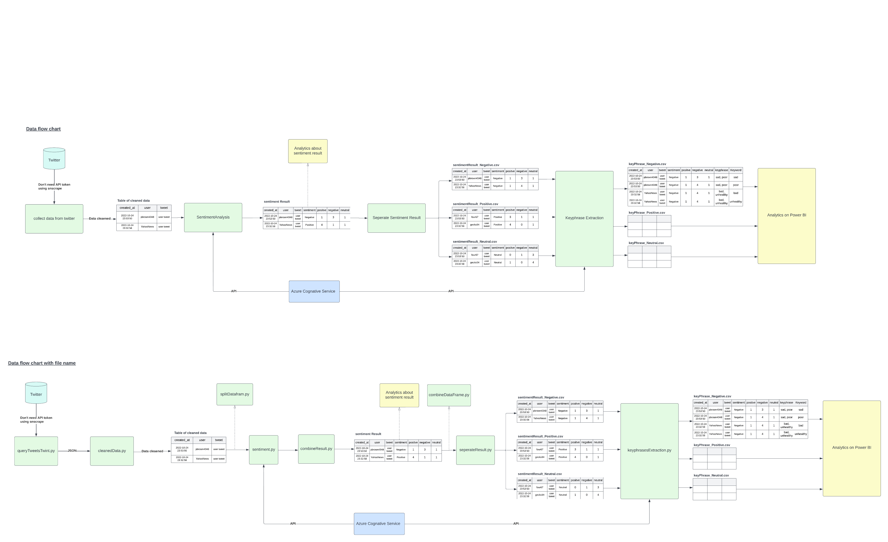

# Twitter Sentiment and Text analysis with Azure Cognative service

This project is about sentiment and text analysis by using python and azure cognative service.
The objective of this project to find the impact of climate change of human wellbeing focus on flooding.

## Data pipeline: 
- Data collection from Twitter
- Data cleansing 
- Sentiment analysis (using Azure cognative service)
- Seperate result (Positiv, Negative, Neutral)
- Keyphrases extraction (using Azure cognative service)


On the first step, Query the tweet from Twitter and cleaned it for example, delete duplication data, delete link, @ sign and hashtage sign becasue those thing will make the result 
of sentiment analysis not accurate.Then Using Azure Cognative service API for analyze all tweets. After we get the result, Analyze this result before move to keyphrases extraction stage.
Next step is seperate sentiment result into four group 1.Positive 2.Negative 3.Neutral 4.Mixed. Afterthat, Using keyphrases extraction from Azure cognative service API to extract the keyword of each group.
Finally, Analyze the result and create the dashboard on Power BI.

### Prerequeisite
Before start to implement this Azure accout is required.
Create resource group. Then create Language service is the part of Cognitive service because we have to use this for 
Sentiment Analysis and Keyphrases Extraction.

1. Clone this reposity
```bash
$ git clone https://github.com/four88/Vcomms_twitter.git
```
2. Move to the directory of this folder and run the below command 
```bash
$ pip install -r requirment.txt 
```

### Data collection and cleansing
#### Without Twitter api token(Using Twint) 
If you don't have Twitter API token. You can use Twint libraly instead. But the negative point is Twint __not allow to query tweet on specific name location.__.
But you can geographic code(Longtitude, Latitude) instead to search on that area. I reccommend to use this webiste to get geographic code [Link to geographic code tools](https://www.mapdevelopers.com/draw-circle-tool.php)

You can set limit number that you want on __c.Limit__ is located on line 12 of __queryTweetsTwint.py__  

```python
def scrape_by_geo(keywords, geocode,since,until, outfile):
    c = twint.Config()
    c.Search = keywords #search keyword c.Since = since
    c.Until = until
    c.Limit = 50000
    c.Geo = geocode
    c.Store_json = True
    c.Output = "output/" + outfile
    c.Hide_output = True
    c.Count = True
    c.Stats = True
    c.Lang = 'en'
    twint.run.Search(c)
```

Next step, editing the name of target directory folder. All tweet that was query from Twitter will located in this folder.  
The name of folder that your create should relate to the country that you going to query the tweet. For example, This time I'm going to query tweet from spain that why I create folder name is Spain

```python
def twint_loop(searchterm, geocode, since, until):
    dirname = clean_name("spain") # create folder in output folder
    try:
    # Create target Directory
        chdir('output') 
        mkdir(dirname)
        print("Directory" , dirname ,  "Created ")
    except FileExistsError:
        print("Directory" , dirname ,  "already exists")

    daterange = pd.date_range(since, until)

    for start_date in daterange:

        since= start_date.strftime("%Y-%m-%d")
        until = (start_date + timedelta(days=1)).strftime("%Y-%m-%d")

        json_name = '%s.json' % since
        json_name = path.join(dirname, json_name)

        print('Getting %s ' % since )
        scrape_by_geo(searchterm,geocode, since, until, json_name)
```

After set the target directory folder, The function for query tweet need 4 parameters.

- Keyword
- Geographic code 
- Starting date
- Ending date

```python
# location geocode
uk_geo = "54.153709,-4.529766,527km"
th_geo = "9.776238,7.742880,800km"
eu_geo = "54.321720,-0.879033,2040km"
germany_geo ="51.163818,10.447831, 400km"
usa_geo ="39.128847,-97.644202, 2100km"
spain_geo = "40.468221,-5.000439, 610km"

# specifid date range for query data
since = '2021-12-31'
until = '2022-11-07'

# call function
twint_loop("'flooding' OR 'flood' OR 'floods'",spain_geo, since, until)
```

Finally, run below commmnd to run this file. 
```bash
$ python3 queryTweetNoApi.py
```
Then you will get a lot of JSON file located in "output/<folder name that your created>". 
Next step, Open __cleanData.py__ located in output folder with your text editor. You have to edit line 12 to folder name that you collect the JSON files. 
Also, edit output filename on final line of code.

```python
import pandas as pd
import numpy as np
import re
import emoji
import nltk
from glob import glob
from os import mkdir, path

nltk.download('words')
words = set(nltk.corpus.words.words())

file_names = glob(path.join('spain','*.json')) # edit folder name to folder that you want to covert all JSON file to CSV
dfs = [pd.read_json(fn, lines = True) for fn in file_names]
tweet_df = pd.concat(dfs)


# cleaner function for remove @ sign, http linke, Emoji and # sign
def cleaner(tweet):
    tweet = re.sub("@[A-Za-z0-9]+","",tweet) #Remove @ sign
    tweet = re.sub(r"(?:\@|http?\://|https?\://|www)\S+", "", tweet) #Remove http links
    tweet = " ".join(tweet.split())
    tweet = ''.join(c for c in tweet if c not in emoji.distinct_emoji_list(c)) #Remove Emojis
    tweet = tweet.replace("#", "").replace("_", " ") #Remove hashtag sign but keep the text
    tweet = " ".join(w for w in nltk.wordpunct_tokenize(tweet) 
         if w.lower() in words or not w.isalpha())
    return tweet


# df = pd.read_csv('output/tweets_eu&uk_dataset.csv') #read file 

tweet_df = tweet_df[['user_id','username', 'date', 'tweet']]

tweet_df['tweet'] =tweet_df['tweet'].map(lambda x: cleaner(x))

tweet_df['tweet'] = tweet_df['tweet'].astype("string")

tweet_df.info()

nan = float("NaN")
tweet_df.replace("",nan, inplace=True)
tweet_df.dropna(subset=['tweet'],inplace=True)

tweet_df.to_csv('tweets_spain_cleaned_dataset.csv') # edit output filename. Change spain to your country working on.
```
After that, run this below command on your terminal to run this file 
This file will convert all the JSON files to one CSV file. And clean all the data remove @ sign, http linke, Emoji and # sign also delete deplication data.
Now you will get CSV file that ready for next step there is Sentiment Analysis.
```bash
$ python3 cleanData.py
```


### Sentiment analysis
After that using Azure cognative service for Sentiment analysis. You need to create Azure account. then create cognative service (Language Service) on Azure. You will get the endpoint URL and Keys for connect to the service.


For connect to Sentiment analysis Azure 
add your __ENDPOINT__ and __KEYS__ in __sentiment.py__
```python
subscription_key = '<YOUR_SUBSCRIPTION_KEY>'
headers = {"Ocp-Apim-Subscription-Key": subscription_key}
endpoint = "<YOUR_ENDPOIN_URL>"

sentiment_url = endpoint + "/text/analytics/v3.0/sentiment"
```
Then run __sentiment.py__
```bash
$ python3 sentiment.py
```
After run this script, You will get __sentimentResult.csv__.\
 This table contain 3 columns
 - Sentiment result
 - Number of positive words
 - Number of negative words
 - Number of neutral words

 Next step we will combine __sentimentResult.csv__ with __tweetCleanedNoApi.csv__\
 By running __combineResult.py__
 ```bash
python3 combineResult.py
```
The result is __sentimentResultCombined.csv__ before move to next step. We should use this file for analysis the result of sentiment.

### Keyphrases Extraction 
After we get sentiment result we have to seperate the result in 3 group (positive, negative, neutral) by running __seperateSentimentResult.py__
 
 ```bash
python3 seperateSentimentResult.py
```
The output has 3 files
- sentimentResult_Negative.csv
- sentimentResult_Positve.csv
- sentimentResult_Neutral.csv

Now we ready for Keyphrases extraction.First set up the __subscription_key__ and __ENDPOINT_URL__ same as sentiment analysis.
```python
subscription_key = '<YOUR_SUBSCRIPTION_KEY>'
headers = {"Ocp-Apim-Subscription-Key": subscription_key}
endpoint = "<YOUR_ENDPOIN_URL>"
keyphrase_url = endpoint + "/text/analytics/v3.0/keyphrases"
```
run this script for get the result of keyphrases extraction from Azure
 ```bash
$ python3 keyphrasesExtraction.py
```
Then we will get the CSV file that ready for analytics\
This table contain 10 columns
- __created_at__ Time that tweet was created
- __user__ Username of tweet
- __tweet__ tweet text
- __location__ locaiton of tweet
- __sentiment__ sentiment result 
- __positive__ Number of positive words
- __negative__ Number of negative words
- __neutral__ Number of neutral words
- __keyPhrases__ list of keywords
- __keyword__ explode __keyPhrases__ into one word __That mean one tweet can have many row__.

### Handle error
In case error occur while your running __sentiment.py__, I reccommend your seperate CSV file that your use for sentiment analysis into 2 parts before running __sentiment.py__.
By using __splitDataframe.py__. Firstly, Open this file with your text editor. Edit line 3 to your file that you want to split the data. Next, move to last 2 lines of code edit the output name.
```python
import pandas as pd

df = pd.read_csv('tweets_spain_cleaned_dataset.csv') # select file that your want to split

half_df =len(df) // 2


def split_dataframe_by_position(df, splits):
    """
    Takes a dataframe and an integer of the number of splits to create.
    Returns a list of dataframes.
    """
    dataframes = []
    index_to_split = len(df) // splits
    start = 0
    end = index_to_split
    for split in range(splits):
        temporary_df = df.iloc[start:end, :] dataframes.append(temporary_df)
        start += index_to_split
        end += index_to_split
    return dataframes

split_dataframes = split_dataframe_by_position(df, 2)
print(split_dataframes[0])

split_dataframes[0].to_csv('tweets_spain_cleaned_dataset_1.csv') # first half of data
split_dataframes[1].to_csv('tweets_spain_cleaned_dataset_2.csv') # second half of data
```
Finally, run this below command on your terminal to run this file.
You will get 2 CSV file that ready for run Sentiment analysis. 
 ```bash
$ python3 splitDatafram.py
```

Moreover, If your use __splitDataframe.py__ before run Sentiment analysis. You should use __combineDataframe.py__ to combine 2 CSV files into 1 CSV file before run __seperateResult.py__. 
To do this, Open __combineDataframe.py__ with your text editor. edit on line 5 and line 8 to your file that your want to combine. Then edit final line to your filename that you want. 

```python
import pandas as pd


# read first half CSV file
df1 = pd.read_csv('spain_sentimentCombinedResult_1.csv')

# read second half CSV file
df2 = pd.read_csv('spain_sentimentCombinedResult_2.csv')

frames= [df1,df2]

result = pd.concat(frames)

# export into one CSV file
result.to_csv('spain_sentimentCombinedResult.csv')
```
Finally, run this below command on your terminal to run this file.
You will get 1 CSV file.  
 ```bash
$ python3 combineDatafram.py
```
